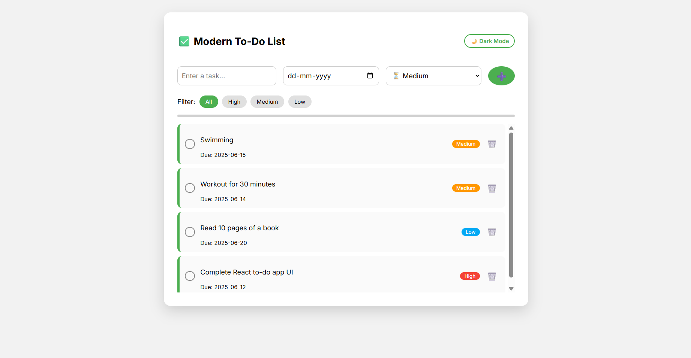
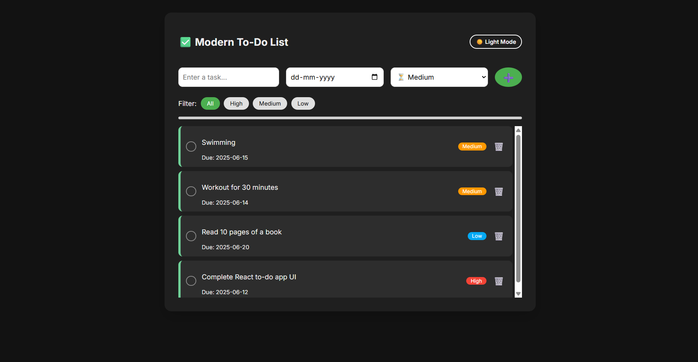

# 📝 Modern React To-Do List App

A clean, responsive, and modern **To-Do List** built with **React + Vite**. Supports task creation, completion marking ✅, deletion 🗑️, filtering 🔍, sorting ⬆⬇, dark/light mode 🌙☀️, and persistent local storage 🔄. Designed with smooth UI/UX in mind using modern CSS and Google Fonts.

---

## 🚀 Features

- ✅ Add, remove, and mark tasks as completed
- 🎨 Modern UI with **dark/light mode toggle**
- 💾 Data persistence via **localStorage**
- 🔍 Filter: All / Active / Completed
- ⬆ Sort: Alphabetical A-Z / Z-A
- 📱 Fully responsive and mobile-friendly
- 🎯 Keyboard-friendly: press **Enter** to add task
- 🧠 Smart focus on input field
- 🧹 Scrollable task area (if list overflows)
- ✨ Stylish Google Fonts and iconography

---

## 📸 Screenshots

### ✅ Light Mode

### 🌙 Dark Mode

---

## 🎬 Demo Video

👉 [Click here to watch the demo on Loom](https://www.loom.com/share/d16143e5b025404ab304b1e6b39535bf?sid=b05b2b54-fd20-4a20-abaf-0c9508d948f8)

---

📁 Project Structure

todo-app/
├── public/
│   └── index.html
├── src/
│   ├── components/
│   │   ├── TodoApp.jsx
│   │   └── TodoApp.css
│   ├── App.jsx
│   ├── main.jsx
│   └── index.css
├── assets/
│   ├── todo-light.png
│   └── todo-dark.png
├── README.md
├── package.json
└── vite.config.js

✅ Testing Guide
  -> Try typing a task and pressing Enter
  -> Toggle between Dark / Light Mode
  -> Try deleting tasks or marking them as complete
  -> Reload to confirm data persistence
  -> Filter and sort using dropdowns
  -> Resize browser to test responsiveness

🧑‍💻 Author
Made with ❤️ by Dev Kaushik.